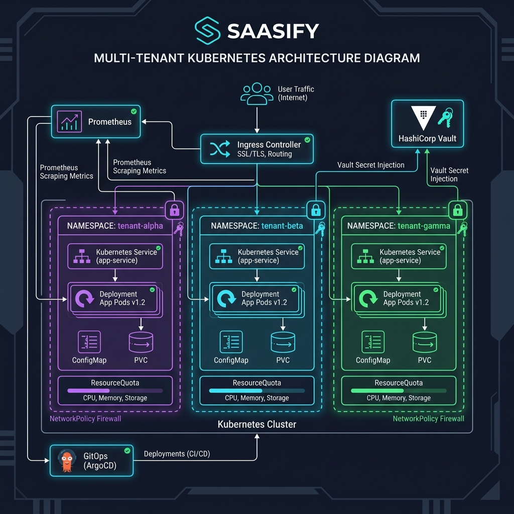
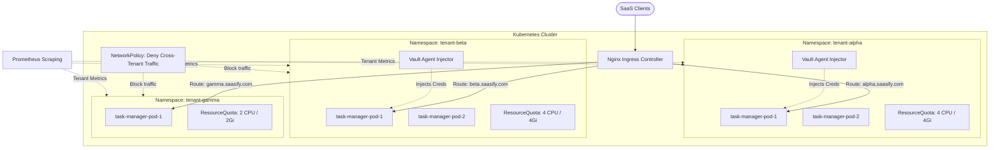

# SaaSify Multi-Tenant Task Management Platform & DevOps Simulator

Welcome to the **SaaSify DevOps & Multi-Tenant Portfolio Project**! 

This repository serves as a complete, industry-standard capstone project that transitions manual, high-risk application deployments into a resilient, containerized, zero-trust, and tenant-aware GitOps platform on Kubernetes.

It contains **both** the real, production-ready DevOps configuration files (Terraform, Kubernetes Manifests, CI/CD pipelines) and an **interactive, simulated DevOps Control Center** showing how all these configurations behave in real-world scenarios (traffic spikes, deployments, security breaches, node failures).

---

## 🏗️ System Architecture

Below is the high-level architecture diagram for the multi-tenant SaaSify platform, demonstrating namespace isolation, ingress routing, resource limits, and zero-trust policies:



### Kubernetes Topology Model


---

## 🚀 Project Overview

The project is structured according to the **6-Month Strategic Roadmap** outlined for the CTO, Alex:

1.  **Phase 1: Foundation & Automation (Months 1-2)**
    *   **IaC**: Standardized AWS EKS cluster deployment with dedicated VPC subnet tagging using Terraform.
    *   **GitOps Pipeline**: Automated testing, linting, container vulnerability scanning (Trivy), and container registry publishing using GitHub Actions.
    *   **Containerization**: Multi-tenant Express.js application ready for containerized deployment.
2.  **Phase 2: Tenant Isolation & Hardening (Months 3-4)**
    *   **Workload Isolation**: Strict `ResourceQuotas` and default container `LimitRanges` per tenant namespace to block "noisy neighbors".
    *   **Zero-Trust Networking**: Kubernetes `NetworkPolicies` preventing cross-namespace communication.
    *   **Availability**: `PodDisruptionBudgets` (PDB) and `HorizontalPodAutoscalers` (HPA) configured for automatic scaling and high-availability updates.
    *   **Secrets & Compliance**: RBAC service accounts with HashiCorp Vault annotation sidecar injections.
3.  **Phase 3: Observability & Resilience (Months 5-6)**
    *   **Observability Portal**: Live DORA metrics dashboard, per-tenant health dashboard, and a live Kubernetes cluster topology mapper.

---

## 📁 Repository Structure

```
├── .github/
│   └── workflows/
│       └── ci.yml           # Phase 1: GitOps CI workflow (Lint, Test, Trivy Scan, Build & Push)
├── terraform/               # Phase 1: Infrastructure as Code
│   ├── main.tf              # Provisioning AWS VPC & EKS Node Groups
│   ├── variables.tf         # Parameter configuration variables
│   └── outputs.tf           # Provisioning deployment outputs
├── k8s/                     # Phase 2: Tenant Isolation & Hardening Manifests
│   ├── tenant-namespaces.yaml    # Alpha, Beta, Gamma namespaces
│   ├── resource-quotas.yaml      # CPU/Memory limits to block noisy neighbors
│   ├── limit-ranges.yaml         # Container default boundaries
│   ├── network-policies.yaml     # Zero-trust inter-namespace traffic blocking
│   ├── hpa-pdb.yaml              # Autoscaling & High-Availability rules
│   └── rbac-vault-secrets.yaml   # RBAC settings & HashiCorp Vault Injectors
├── app/                     # Node.js Application & Simulator Dashboard
│   ├── public/              # Static Frontend Webpages
│   │   ├── index.html       # Dashboard dashboard layout
│   │   ├── style.css        # Curated Dark-Mode Glassmorphism styling
│   │   └── app.js           # Dynamic metrics fetching and simulation triggers
│   ├── server.js            # Express API serving app endpoints & simulation triggers
│   └── package.json         # Node.js dependencies
└── README.md                # This portfolio documentation guide
```

---

## 🛠️ Running the Project Locally

The project includes a **DevOps Simulation Engine** that allows you to run and view the entire cluster in action on your local machine without needing cloud credits or local cluster overheads.

### Prerequisites

*   [Node.js](https://nodejs.org/) (Version 16.0.0 or higher)

### Installation & Run

1.  Clone this repository or locate the project files.
2.  Navigate to the `app` folder:
    ```bash
    cd app
    ```
3.  Install dependencies:
    ```bash
    npm install
    ```
4.  Start the application server:
    ```bash
    npm start
    ```
5.  Open your browser and navigate to:
    ```
    http://localhost:3000
    ```

---

## 🕹️ Interactive Simulator Walkthrough

Once the portal is open in your browser, check out these features:

### 1. Multi-Tenant Task Manager
Go to the **Tenant App** tab in the sidebar:
*   Switch namespaces (`tenant-alpha`, `tenant-beta`, `tenant-gamma`) at the top.
*   Add, check, and delete tasks. The data is kept entirely isolated under each tenant scope.
*   The side panel will explain which specific Kubernetes configuration file (e.g., `resource-quotas.yaml`, `network-policies.yaml`) secures that workspace.

### 2. DORA Metrics & Observability
Go to the **CTO Dashboard** tab:
*   **DORA Cards**: Shows Deployment Frequency, Lead Time, Change Failure Rate, and MTTR.
*   **Tenant Monitoring Matrix**: Monitor real-time CPU/Memory usage, active replicas, request latency, and SLO uptime.
*   **Kubernetes Event Logs**: Bottom console showing live Kubernetes API output, GitOps syncs, and security alerts.

### 3. Simulation Triggers
Try firing these DevOps events in the dashboard:
*   **Run GitOps Deploy**: Runs a mock code push, triggers a GitHub Action build/linter run, runs a Trivy vulnerability scan, and synchronizes the cluster via ArgoCD. Updates DORA metrics.
*   **Traffic Spike (HPA Test)**: Floods `tenant-alpha` with traffic. Watch latency rise and trigger an HPA scale-out event scaling replicas from 2 to 6, returning response times back to normal.
*   **Noisy Neighbor Workload**: Launches a heavy workload on `tenant-alpha`. Watch how K8s resource quotas clamp the usage to prevent it from starving `tenant-beta` or `tenant-gamma`.
*   **Network Policy Attack**: Attempts to hop namespaces to access an isolated DB service. Watch the dashboard flash red as the Network Policy interceptor actively drops the traffic.
*   **Node Failure Outage**: Shuts down a cluster node. Watch replica count drop but stay at 1 due to the PodDisruptionBudget (PDB), protecting user availability.
